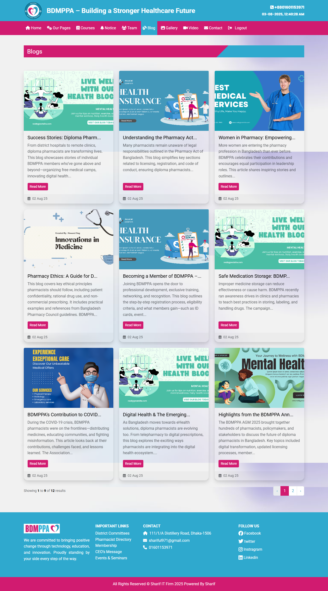
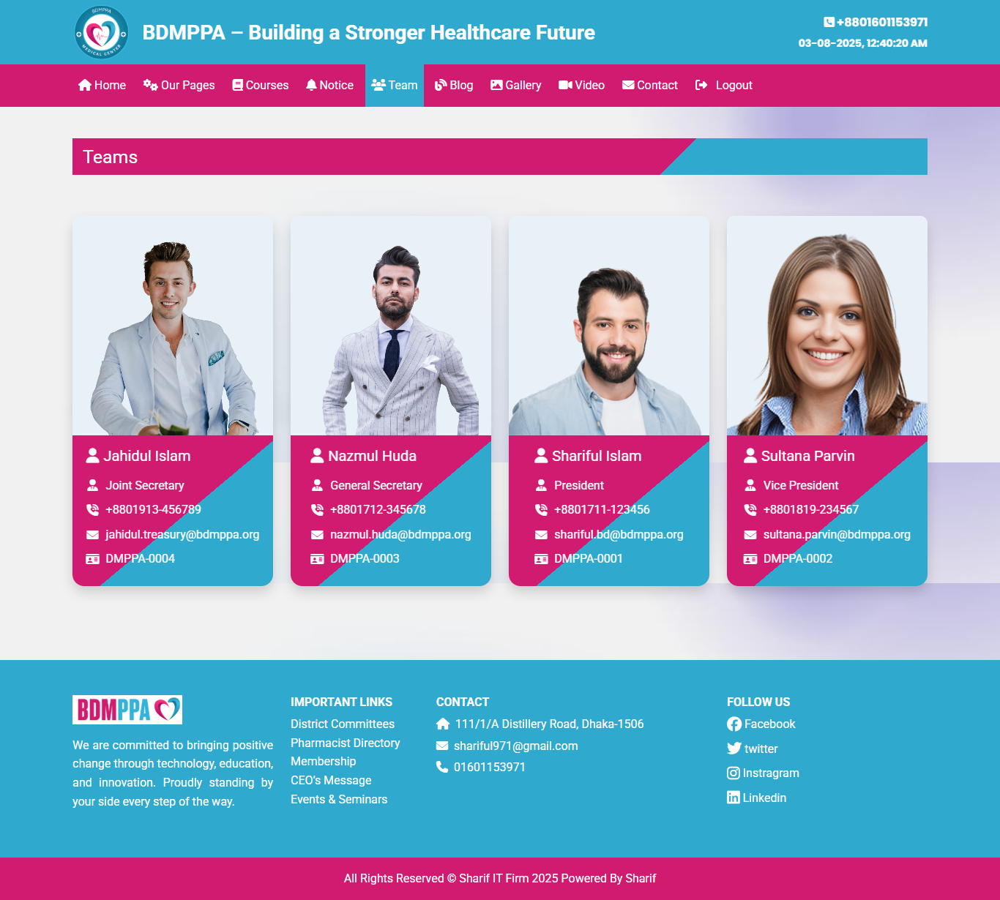
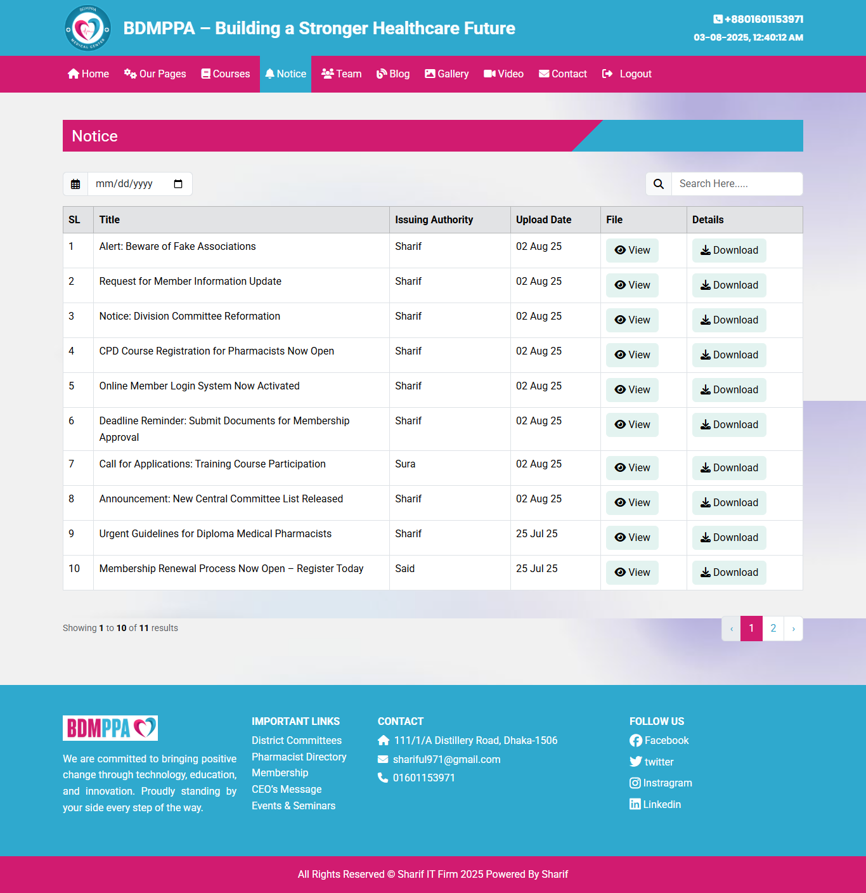
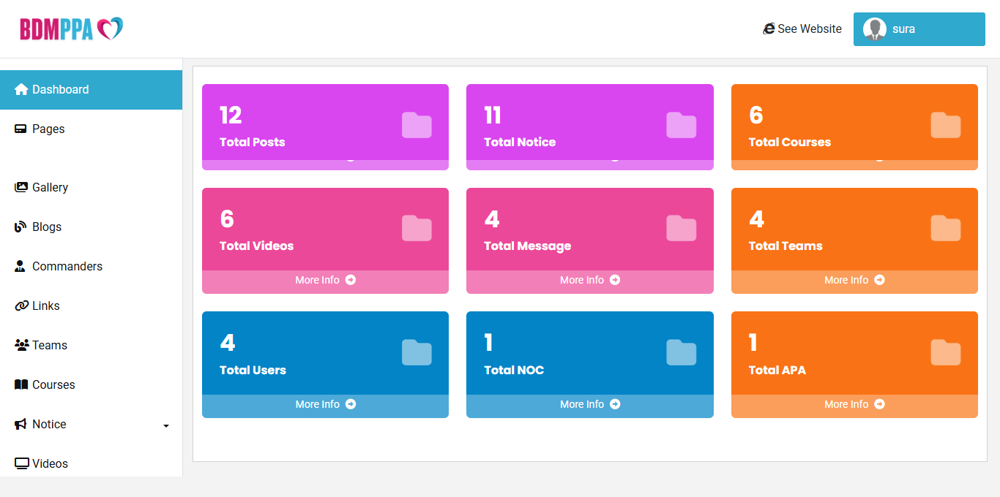

## BDMPPA
Developed by: Shariful Islam
BDMPPA Official Website SPA(Single Page Application)

## ✨ Features
-Powerful Admin Dashboard
-User Roles & Permissions
-Blog & Category Management
-Our Services Module
-Courses Listing
-News & Notices
-SEO Ready
-Clean & Modular Code
-Installer Wizard Included

## 🚀 Installation

This project includes an **automatic installation wizard**.

1. **Upload** all files to your server.
2. Open your domain in a browser.
3. Follow the **on-screen installation steps**.

## Acknowledgements
- Laravel Documentation
- Bootstrtap
- Livewire

## 📄 License

This project is licensed under the MIT License - see the [LICENSE](./LICENSE) file for details.

## 📞 Support

For support, please contact:  
📧 Email: shariful971@gmail.com

## 📝 Changelog

**v1.0.0** – Initial release  